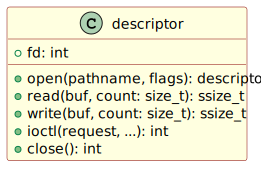

# I2C Device on Linux

I<sup>2</sup>C is a standard ubiquitous protocol for communication
within embedded systems between a central processing unit and its
external peripherals. Most embedded chip-sets incorporate I<sup>2</sup>C
communication hardware and embedded vendors include driver-level
software within their Hardware Abstraction Layer for efficiently
handling low-level transfers over I<sup>2</sup>C. The protocol clocks
bits over two wires $SDA$ and $SCL$, serial data and serial clock
respectively. Some embedded systems refer to the protocol as a
“two-wire” interface for this reason.

But what about Linux? Though arguably not an embedded operating system,
it can be found in embedded scenarios with sufficiently powerful cores
equipped with sufficient amounts of memory. Embeddable distributions of
Linux typically provide kernel drivers that map the two-wire
I<sup>2</sup>C write-read protocol to standard Unix file descriptor
accessors. The developer opens a “character device” and uses standard
writes and reads to perform transfers. I<sup>2</sup>C devices appear at
`/dev/i2c-` followed by a number to identify the controller channel.

In object modelling terms, the “descriptor” model of input-output for
Unix appears below,
<a href="#fig-unix-descriptor" class="quarto-xref">Figure 1</a>. A
“descriptor” acts as a connector between a user-land program and the
kernel. Linux maps an I<sup>2</sup>C connection to a Unix descriptor.
The *input-output control* method allows for arbitrary command requests.
The Linux kernel driver uses this interface to configure the channel or
to perform advanced transfers; user programs configure the
I<sup>2</sup>C slave address using this generalised interface.

<div id="fig-unix-descriptor">




Figure 1: Unix descriptor “class” model. This is a conceptual depiction.
The *open* method appears in the model as a static answering a
*descriptor* instance. The C library answers the underlying *file
descriptor* handle, in practice, and the instance methods receive the
handle as the first argument.

</div>

It sounds simple. Is it? The following sections develop a simple wrapper
library for [SWI-Prolog](https://www.swi-prolog.org/) Rohner and
Kjellerstrand ([2023](#ref-Rohner2023)). Find the completed sources for
the Prolog pack on GitHub and at the SWI-Prolog add-ons.

# Prolog Pack

To test out the interface, a “foreign” library for Prolog will wrap the
descriptor model. The pack will provide the following I<sup>2</sup>C
predicates.

- `i2c_open(+Dev, -I2C)` to open a device.
- `i2c_funcs(+I2C, ?Funcs)` to query functionality.
- `i2c_slave(+I2C, +Addr)` to configure the slave address.
- `i2c_write(+I2C, ++Bytes, ?Actual)` to write bytes.
- `i2c_read(+I2C, +Expected, ?Bytes)` to read bytes.

The predicate descriptions show the [argument
modes](https://www.swi-prolog.org/pldoc/man?section=preddesc). Note the
double plus when writing $Bytes$, a list of integer terms. Also note,
the read operation has partial ground $Bytes$. Reading performs a
complete read using a stack-based buffer and then unifies the resulting
octets with the argument. The read succeeds when the buffer contents
successfully unify with the argument. In other words, reading can check
against some fully complete or partially complete expectations about the
response.

Notice that the predicates exclude a close operation.

## No Close

The pack does not provide an `i2c_close` predicate. That may seem
strange. The developer can open a device but not close it. It takes a
lazy approach instead. The open descriptor only closes when the garbage
collector releases the I<sup>2</sup>C blob. This carries with it one
disadvantage: holding the descriptor open longer than necessary.

Typical usage does not require eager closing, however. The typical
embedded scenario keeps its I<sup>2</sup>C connection open indefinitely.
The connection and its open file descriptor belong to a service that
operates continuously. The open descriptor only needs to close when the
service ends. The garbage collector releases the device blob on program
termination. Linux itself will close the descriptor when its owner
process dies.

## Device Blob

In essence, the Prolog pack provides a “blob” for an I<sup>2</sup>C
descriptor. The code extract below lists the C code that defines the
blob and illustrates how it unifies a $Term$ variable with a file
descriptor $fd$ integer. In Prolog’s world, the blob exists as an atom
with some invisible, opaque state.

``` c
PL_blob_t i2c_dev_blob_type =
{ .magic = PL_BLOB_MAGIC,
  .name = "i2c_dev",
  .release = release_i2c_dev,
  .write = write_i2c_dev,
};

int unify_i2c_dev(term_t Term, int fd)
{ struct linux_i2c_dev *blob = PL_malloc(sizeof(*blob));
  (void)memset(blob, 0, sizeof(*blob));
  blob->fd = fd;
  return PL_unify_blob(Term, blob, sizeof(*blob), &i2c_dev_blob_type);
}
```

Opening an I<sup>2</sup>C device becomes a simple process: opening the
device, turning a device number into a path and asking the kernel to
open it for read-write access.

``` c
foreign_t i2c_open_2(term_t Dev, term_t I2C)
{ int dev;
  char pathname[PATH_MAX];
  int fd;
  if (!PL_get_integer(Dev, &dev)) PL_fail;
  Ssnprintf(pathname, sizeof(pathname), "/dev/i2c-%d", dev);
  if (0 > (fd = open(pathname, O_RDWR))) return i2c_errno("open");
  return unify_i2c_dev(I2C, fd);
}
```

The final `return` statement calls the blob unification function listed
previously.

# Usage

It works well. The following section takes the pack for a ‘drive’ by
talking to a PCA9685.

## NXP Semiconductor’s PCA9685

What is the
[PCA9685](https://www.nxp.com/products/interfaces/ic-spi-i3c-interface-devices/i3c-interface-devices/led-drivers/16-channel-12-bit-pwm-fm-plus-ic-bus-led-driver:PCA9685)?
To paraphrase NXP Semiconductor,

> “The PCA9685 is a 16-channel LED controller that operates via
> I<sup>2</sup>C-bus, specifically designed for Red/Green/Blue/Amber
> (RGBA) colour back-lighting applications. Each LED output features its
> own 12-bit resolution, equating to 4096 brightness levels, managed by
> a dedicated PWM (Pulse Width Modulation) controller. This controller
> can be programmed to operate at frequencies ranging from a typical 24
> Hz to 1526 Hz, with the duty cycle adjustable between 0% and 100%,
> allowing for precise control over brightness levels. Notably, all
> outputs maintain the same PWM frequency, ensuring consistency in
> lighting performance.”

``` prolog
%!  led_adr(?OnOff, ?LH, ?Adr0) is nondet.
%
%   Adr0 is the PWM control's on-off low-high relative register address
%   offset, between 0 and 3 inclusive.

led_adr(on,  l, 0x00).
led_adr(on,  h, 0x01).
led_adr(off, l, 0x02).
led_adr(off, h, 0x03).

%!  reg_adr(?Reg, ?Adr) is nondet.
%
%   Maps the entire PCA9685 register file.

reg_adr(mode(Mode), Adr) :-
    between(1, 2, Mode),
    Adr is 0x00 + Mode - 1.
reg_adr(subadr(SubAdr), Adr) :-
    between(1, 3, SubAdr),
    Adr is 0x02 + SubAdr - 1.
reg_adr(allcalladr, 0x05).
reg_adr(led(LED, OnOff, LH), Adr) :-
    between(0, 15, LED),
    led_adr(OnOff, LH, Adr0),
    Adr is 0x06 + Adr0 + (0x04 * LED).
reg_adr(led(all, OnOff, LH), Adr) :-
    led_adr(OnOff, LH, Adr0),
    Adr is 0xfa + Adr0.
reg_adr(pre(scale), 0xfe).
reg_adr(test(mode), 0xff).
```

### Reading the first mode register

This becomes a straightforward clause sequence: open the device $Dev=1$
by number, configure the slave address $Addr=40_{16}$.

``` prolog
    i2c_dev(Dev),
    i2c_open(Dev, I2C),
    pca9685_addr(Addr),
    i2c_slave(I2C, Addr),
    ai(I2C),
    % Write 00 to the Control Register.
    % It determines access to the other registers.
    i2c_write(I2C, [0x00]),
    i2c_read(I2C, [Byte]).
```

## Enabling the control register’s auto-increment (AI) feature

The PCA9685 disables the control register’s auto-increment (AI) function
on restart. It needs enabling. Enable AI idempotently by reading the
$Mode1$ register. If the register has zero in the fifth bit, perform a
write-back with the fifth bit set. Retain all other bits.

``` prolog
ai(I2C) :-
    reg_adr(mode(1), Adr),
    rd(I2C, Adr, [Mode1]),
    (   Mode1 /\ 2'0010_0000 =\= 0x00
    ->  true
    ;   Mode1_ is Mode1 \/ 2'0010_0000,
        wr(I2C, Adr, [Mode1_])
    ).
```

Non-AI mode is less useful. Arguably, AI-enabled *should* be the
default. If the Control Register retains its content, the device
accesses the same register at every read operation.

# Conclusions

The Linux kernel driver makes I<sup>2</sup>C easy. The half-duplex
protocol fits neatly beneath the standard Unix file descriptor access
interface: `open`, `ioctl`, `read`, `write`. It also supports a more
sophisticated interface using message buffers—not covered here.

The pack presents the simplest connection to an I<sup>2</sup>C
controller. It does not use `i2c_msg` but instead leaves that step to
future iterations. That would eliminate task switching between transfer
segments, however. User-land would only resume at the end of all
transfer segments. The kernel handles the entire transfer in such a
case. The model based on Unix descriptors gives a simple level of access
but not one without limitations. It adds some latency between reads and
writes. Descriptor read-write is not an optimal implementation by any
means but proves adequate for most requirements.

# References

<div id="refs" class="references csl-bib-body hanging-indent"
entry-spacing="0">

<div id="ref-Rohner2023" class="csl-entry">

Rohner, Jean-Christophe, and Håkan Kjellerstrand. 2023. “Prolog for
Scientific Explanation.” In *Prolog: The Next 50 Years*, edited by David
S. Warren, Veronica Dahl, Thomas Eiter, Manuel V. Hermenegildo, Robert
Kowalski, and Francesca Rossi, 372–85. Cham: Springer Nature
Switzerland. <https://doi.org/10.1007/978-3-031-35254-6_30>.

</div>

</div>
